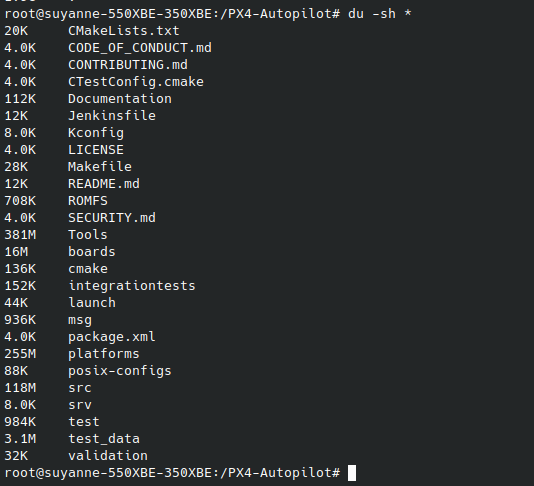
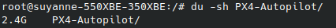

Clone o repositório com:

```bash
    git clone git@github.com:edra-unb-fga/docker-configuration.git
```
### 1. Build da imagem
⚠️ A imagem é gigante e pesada mas contém tudo de que precisamos (na teoria) referente a px4, simuladores e o ros, por favor, não se assuste. O tempo de build estimado está entre 1h30-2h.

A imagem completa 100% funcional é a complete/complete/v0.1.Dockerfile, para roda-la, basta usar o comando:
```bash
    sudo docker compose up -d
```
Obs: Existem outros servicos comentados separadamente no docker-compose.yml, caso queira builda-los, basta descomentar.

### 2. Rode o comando abaixo no seu terminal, fora do container. Ele é necessário para que o gazebo tenha permissão de funcionamento dentro do container.
```bash
    xhost local:docker
```

### 3. Rode o container

Após buildado, entre no container através do seguinte comando:
```bash
    sudo docker exec -it ros-px4-complete /bin/bash
```

### 4. Verificações

Você pode verificar se o ros2 está sendo identificado rodando:
```bash
    ros2
```

Com esse comando um guia de comandos do ros2 devem aparecer, mas caso ocorra um erro, rode o seguinte comando dentro do container e depois tente rodar ros2 novamente:

```bash
    echo "source /opt/ros/foxy/setup.bash" >> ~/.bashrc && echo "source /opt/ros/foxy/setup.sh" >> ~/.bashrc
```

Você pode ainda checar a versão do ubuntu:
```bash
    lsb_release -a
```
Ou que o gazebo está abrindo corretamente com o comando a seguir, ele deve abrir uma janela da aplicação:
```bash
    gazebo
```


<!-- Firulas necessárias para análise-->
<!-- VER DEPENDENCIAS DE UM PACOTE PARA EVITAR INSTALACOES DUPLICADAS -->
apt-cache depends ros-foxy-ros-core=0.9.2-1*

<!-- Verifique se todos os pacotes listados estão instalados usando o comando  -->
dpkg -s <nome do pacote>.





2.4GB depois de buildada e tudo (o repo da px4)