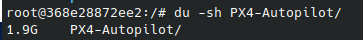
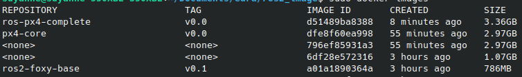

clone the repo

<!-- BUILDAR OS SERVICOS -->
sudo docker compose up -d

<!-- RODAR O CONTAINER -->
sudo docker exec -t ros2-test-1 /bin/bash

echo "source /opt/ros/foxy/setup.bash" >> ~/.bashrc

<!-- AO ENTRAR NO CONTAINER -->
source /opt/ros/foxy/setup.bash

<!-- CHECAR VERSAO DO UBUNTU NO CONTAINER -->
lsb_release -a

<!-- CHECAR QUE O ROSFOXY EXISTE NO CONTAINER -->
printenv ROS_DISTRO

<!-- VER DEPENDENCIAS DE UM PACOTE PARA EVITAR INSTALACOES DUPLICADAS -->
apt-cache depends ros-foxy-ros-core=0.9.2-1*

<!-- Verifique se todos os pacotes listados estão instalados usando o comando  -->
dpkg -s <nome do pacote>.

numpy>=1.20

3.36-1.9=1.46 sem o repo da px4